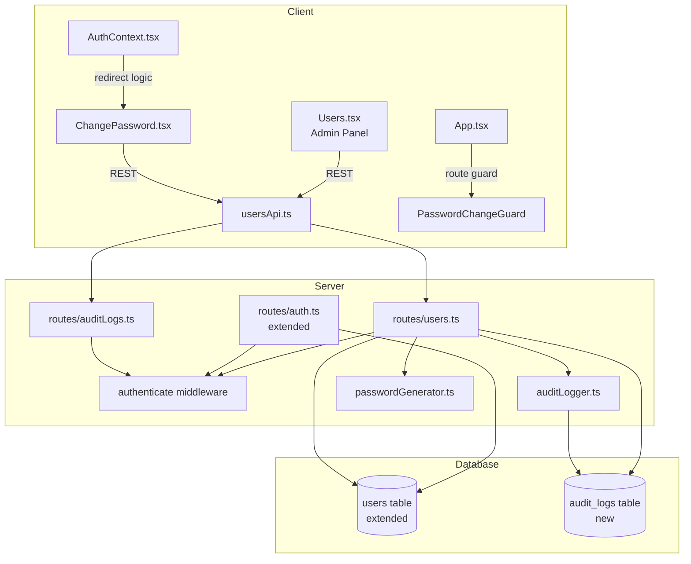
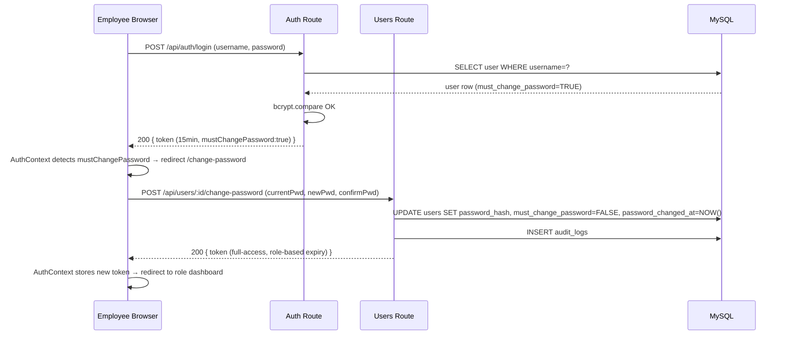

# Design Document

## User Account Management

### Overview

This feature implements the full lifecycle of employee accounts in the Isra Hardware POS system. An administrator creates accounts (Cashier or Inventory Clerk) through the User Management Panel; the system generates a cryptographically secure temporary password and returns it once. On first login — or after a password reset — the employee is intercepted by a mandatory password change flow before reaching their dashboard. Administrators can also reset passwords and deactivate accounts. All account-related events are recorded in an append-only `audit_logs` table.

The design extends the existing JWT-based authentication without replacing it. A second, shorter-lived JWT variant (15 min, `mustChangePassword: true`) gates the change-password page; a full-access JWT is issued only after the employee completes the change.

---

### Architecture

The system follows the existing three-tier layout: React/TypeScript client → Express/TypeScript API → MySQL database. This feature adds new routes, utilities, and UI pages while extending three existing files.



**Request flow — first login with temp password:**



---

### Components and Interfaces

#### New Server Files

**`server/utils/passwordGenerator.ts`**
Exports a single function `generateTempPassword(): string`. Uses `crypto.randomBytes` to build a 10–12 character password guaranteed to contain at least one uppercase letter, one lowercase letter, one digit, and one special character from `!@#$%^&*`. The algorithm: pick one character from each required class, then fill remaining slots from the full character set, shuffle using a Fisher-Yates algorithm seeded from `crypto.randomBytes`.

```typescript
export function generateTempPassword(): string
```

**`server/utils/auditLogger.ts`**
Exports a single async function. Inserts one row into `audit_logs` and swallows errors (logs to `console.error`) so audit failures never roll back the primary operation.

```typescript
export async function logAuditEvent(params: {
  action: "account_created" | "password_reset" | "password_changed" | "account_deactivated";
  performedById: number;
  performedByUsername: string;
  targetUserId?: number;
  targetUsername?: string;
  metadata?: Record<string, unknown>;
}): Promise<void>
```

**`server/routes/users.ts`**

| Method | Path | Role | Description |
|--------|------|------|-------------|
| GET | `/api/users` | Admin | Paginated list of all users (no password_hash) |
| POST | `/api/users` | Admin | Create user; returns `{ user, tempPassword }` |
| PUT | `/api/users/:id` | Admin | Edit full_name, role, status, employee_id |
| POST | `/api/users/:id/reset-password` | Admin | Reset to new temp password; returns `{ tempPassword }` |
| POST | `/api/users/:id/deactivate` | Admin | Set status=Inactive |
| POST | `/api/users/:id/change-password` | Any authenticated (self) | Change from temp to permanent password |

All routes except `change-password` enforce `req.user.role === "Admin"` after the `authenticate` middleware.

The `change-password` endpoint additionally accepts the scoped JWT (`mustChangePassword: true`) so it works during the mandatory change flow.

**`server/routes/auditLogs.ts`**

| Method | Path | Role | Description |
|--------|------|------|-------------|
| GET | `/api/audit-logs` | Admin | Paginated audit entries (page, pageSize query params) |

#### Modified Server Files

**`server/routes/auth.ts`** — after successful credential + status check, add:
```typescript
// NEW: check must_change_password
if (user.must_change_password) {
  // issue 15-min restricted token
  const restrictedToken = jwt.sign({ ...payload, mustChangePassword: true }, secret, { expiresIn: "15m" });
  res.status(200).json({ token: restrictedToken, user: { ...payload, mustChangePassword: true } });
  return;
}
// existing full-access token logic unchanged
```

**`server/middleware/authenticate.ts`** — extend `AuthPayload`:
```typescript
export interface AuthPayload {
  id: number;
  full_name: string;
  username: string;
  role: "Admin" | "Inventory Clerk" | "Cashier";
  employee_id: string | null;
  mustChangePassword?: boolean;   // NEW — present only in restricted tokens
}
```

**`server/index.ts`** — mount new routes:
```typescript
import usersRoutes from "./routes/users.js";
import auditLogsRoutes from "./routes/auditLogs.js";
// ...
app.use("/api/users", usersRoutes);
app.use("/api/audit-logs", auditLogsRoutes);
```

#### New Client Files

**`client/src/shared/api/usersApi.ts`**
Axios-based API client. Reads the JWT from `loadToken()` and sets the `Authorization` header on every call.

```typescript
export interface UserRecord {
  id: number;
  full_name: string;
  username: string;
  role: "Admin" | "Inventory Clerk" | "Cashier";
  employee_id: string | null;
  status: "Active" | "Inactive";
  must_change_password: boolean;
  password_changed_at: string | null;
  updated_at: string | null;
}

export interface CreateUserPayload {
  full_name: string;
  username: string;
  employee_id?: string;
  role: "Cashier" | "Inventory Clerk";
  status: "Active" | "Inactive";
}

export interface CreateUserResponse {
  user: UserRecord;
  tempPassword: string;
}

export async function getUsers(): Promise<UserRecord[]>
export async function createUser(payload: CreateUserPayload): Promise<CreateUserResponse>
export async function updateUser(id: number, payload: Partial<CreateUserPayload>): Promise<UserRecord>
export async function resetPassword(id: number): Promise<{ tempPassword: string }>
export async function deactivateUser(id: number): Promise<void>
export async function changePassword(id: number, payload: {
  currentPassword: string;
  newPassword: string;
  confirmPassword: string;
}): Promise<{ token: string; user: AuthUser }>
```

**`client/src/shared/api/auditLogsApi.ts`**

```typescript
export interface AuditLogEntry {
  id: number;
  action: string;
  performed_by_id: number;
  performed_by_username: string;
  target_user_id: number | null;
  target_username: string | null;
  metadata: Record<string, unknown> | null;
  created_at: string;
}

export interface AuditLogsResponse {
  entries: AuditLogEntry[];
  total: number;
  page: number;
  pageSize: number;
}

export async function getAuditLogs(page?: number, pageSize?: number): Promise<AuditLogsResponse>
```

**`client/src/pages/ChangePassword.tsx`**
Standalone page (not inside AdminLayout or ClerkLayout). Displays the mandatory change notice, three password fields with show/hide toggles, a real-time strength indicator, and a submit button. On success, stores the new token and redirects. On failure, displays inline per-field error messages returned by the API.

Password strength scoring:
- Weak: length < 8 or missing 2+ character classes
- Fair: length >= 8, missing exactly 1 character class
- Strong: length >= 8, all 4 character classes present

**`client/src/shared/components/PasswordChangeGuard.tsx`**
A wrapper component that reads the decoded JWT from `AuthContext`. If `user.mustChangePassword === true`, it renders its children (only the `/change-password` route should use this as a gate). For all other protected routes, if `user.mustChangePassword === true`, the component redirects to `/change-password` instead of rendering.

This is implemented by extending `ProtectedRoute` with an additional check: before rendering children, if `user.mustChangePassword` is set, redirect to `/change-password`.

#### Modified Client Files

**`client/src/shared/utils/auth.ts`**
- Add `mustChangePassword?: boolean` to `AuthUser`
- Update `getUserFromToken` to extract `mustChangePassword` from the decoded payload
- Update `getRedirectPath` to return `"/change-password"` when `mustChangePassword === true`

**`client/src/shared/contexts/AuthContext.tsx`**
- The `login` function already calls `getRedirectPath(data.user.role)`. Since `getRedirectPath` will be updated to check `mustChangePassword`, no further changes are needed in most cases.
- On mount rehydration: if the stored token has `mustChangePassword: true`, set `user` with that flag so `ProtectedRoute` can enforce the guard.

**`client/src/App.tsx`**
Add the `/change-password` route as a public-ish route (accessible with the restricted JWT, not just a full-access JWT). It must be placed before the catch-all Admin route:
```tsx
<Route path="/change-password">
  <ChangePasswordGuard>
    <ChangePassword />
  </ChangePasswordGuard>
</Route>
```

**`client/src/modules/admin/pages/Users.tsx`**
Replace static mock data with real API calls. Add:
- Create User modal (fields per Requirement 3.2)
- Temp password display after creation (read-only, Copy, Print)
- Reset Password confirmation dialog + temp password display
- Deactivate confirmation dialog
- Loading/disabled states during in-flight requests
- Inline error banner on API failure

---

### Data Models

#### `users` table (extended)

Existing columns remain unchanged. Three new columns are added via `ALTER TABLE ... ADD COLUMN IF NOT EXISTS`:

```sql
-- Migration: 001_add_password_lifecycle.sql
ALTER TABLE users
  ADD COLUMN IF NOT EXISTS must_change_password BOOLEAN NOT NULL DEFAULT TRUE,
  ADD COLUMN IF NOT EXISTS password_changed_at  DATETIME NULL,
  ADD COLUMN IF NOT EXISTS updated_at           DATETIME NULL;
```

Full column set after migration:

| Column | Type | Notes |
|--------|------|-------|
| `id` | INT AUTO_INCREMENT PK | existing |
| `full_name` | VARCHAR | existing |
| `username` | VARCHAR UNIQUE | existing |
| `password_hash` | VARCHAR | existing; never returned in API responses |
| `role` | ENUM('Admin','Inventory Clerk','Cashier') | existing |
| `employee_id` | VARCHAR NULL | existing |
| `status` | ENUM('Active','Inactive') | existing |
| `must_change_password` | BOOLEAN NOT NULL DEFAULT TRUE | **new** |
| `password_changed_at` | DATETIME NULL | **new** |
| `updated_at` | DATETIME NULL | **new** |

#### `audit_logs` table (new)

```sql
CREATE TABLE IF NOT EXISTS audit_logs (
  id                     INT          NOT NULL AUTO_INCREMENT,
  action                 VARCHAR(64)  NOT NULL,
  performed_by_id        INT          NOT NULL,
  performed_by_username  VARCHAR(255) NOT NULL,
  target_user_id         INT          NULL,
  target_username        VARCHAR(255) NULL,
  metadata               JSON         NULL,
  created_at             DATETIME     NOT NULL DEFAULT CURRENT_TIMESTAMP,
  PRIMARY KEY (id),
  CONSTRAINT fk_audit_performed_by FOREIGN KEY (performed_by_id) REFERENCES users(id),
  CONSTRAINT fk_audit_target       FOREIGN KEY (target_user_id)  REFERENCES users(id)
) ENGINE=InnoDB DEFAULT CHARSET=utf8mb4;
```

#### JWT Payloads

**Restricted token** (issued when `must_change_password = TRUE`):
```json
{
  "id": 42,
  "full_name": "Jane Doe",
  "username": "jane.doe",
  "role": "Cashier",
  "employee_id": "EMP-007",
  "mustChangePassword": true,
  "iat": 1700000000,
  "exp": 1700000900
}
```
Expires in 15 minutes. No `rememberMe` extension applies.

**Full-access token** (issued after successful password change or normal login):
```json
{
  "id": 42,
  "full_name": "Jane Doe",
  "username": "jane.doe",
  "role": "Cashier",
  "employee_id": "EMP-007",
  "iat": 1700000000,
  "exp": 1700028800
}
```
`mustChangePassword` claim is absent (not set to `false` — simply omitted so the absence is unambiguous).

---

## Correctness Properties

*A property is a characteristic or behavior that should hold true across all valid executions of a system — essentially, a formal statement about what the system should do. Properties serve as the bridge between human-readable specifications and machine-verifiable correctness guarantees.*

---

### Property 1: Password generator invariants

*For any* call to `generateTempPassword()`, the returned string SHALL have a length between 10 and 12 (inclusive), contain at least one uppercase letter, at least one lowercase letter, at least one digit, and at least one character from the set `!@#$%^&*`.

**Validates: Requirements 2.1, 2.2, 2.6**

---

### Property 2: Bcrypt hash round-trip with cost factor

*For any* plaintext string hashed via the Bcrypt_Hasher, calling `bcrypt.compare(plaintext, hash)` SHALL return `true`, and the resulting hash string SHALL encode a cost factor of at least 10 (i.e., the hash begins with `$2b$10$` or higher).

**Validates: Requirements 2.4, 7.1**

---

### Property 3: Temporary password activation sets lifecycle flags

*For any* valid account creation or password reset operation, the target user record in the database SHALL have `must_change_password = TRUE` and `password_changed_at = NULL` immediately after the operation completes, regardless of what those values were before.

**Validates: Requirements 3.4, 5.3**

---

### Property 4: User creation input validation rejects all invalid payloads

*For any* `POST /api/users` request payload that is missing a required field (`full_name`, `username`, `role`, or `status`) or contains an invalid value, the User_API SHALL return HTTP 422 with a non-empty array of field-level error messages, and SHALL NOT create a new user record.

**Validates: Requirements 3.8**

---

### Property 5: First login with temp password issues a restricted JWT

*For any* user whose `must_change_password = TRUE` in the database, a valid login request that passes credential and status checks SHALL result in a JWT where the `mustChangePassword` claim is `true` and the token expires within 15 minutes of issuance.

**Validates: Requirements 4.1**

---

### Property 6: Password change validation enforces all complexity rules

*For any* `POST /api/users/:id/change-password` request, the User_API SHALL reject the request with HTTP 422 if and only if at least one of the following is true: (a) the current password does not match the stored hash, (b) the new password is fewer than 8 characters, (c) the new password lacks at least one uppercase letter, one lowercase letter, one digit, or one special character, or (d) the new password does not match the confirm password field.

**Validates: Requirements 4.6, 4.7**

---

### Property 7: Successful password change updates all lifecycle fields

*For any* password change that passes all validations in Property 6, the User_API SHALL update the target user's `password_hash` to the bcrypt hash of the new password, set `must_change_password = FALSE`, and set `password_changed_at` to a non-null DATETIME representing the time of the operation.

**Validates: Requirements 4.8**

---

### Property 8: Role-based redirect path is correct for every role

*For any* `AuthUser` whose `mustChangePassword` is absent or `false`, `getRedirectPath(user.role)` SHALL return `"/"` for `"Admin"`, `"/clerk/dashboard"` for `"Inventory Clerk"`, and `"/cashier"` for `"Cashier"`. *For any* user whose `mustChangePassword === true`, `getRedirectPath` SHALL return `"/change-password"`.

**Validates: Requirements 4.9**

---

### Property 9: Account deactivation sets status and timestamp

*For any* confirmed deactivation of a user account, the User_API SHALL set `status = 'Inactive'` and `updated_at` to a non-null DATETIME, and these values SHALL be persisted in the database immediately after the operation.

**Validates: Requirements 6.2**

---

### Property 10: Inactive account login is rejected with HTTP 403

*For any* user whose `status = 'Inactive'`, a login attempt with any credentials SHALL result in HTTP 403 with the message `"Your account has been deactivated. Please contact your administrator."` and SHALL NOT issue a JWT.

**Validates: Requirements 6.3**

---

### Property 11: API responses never expose password fields

*For any* response from `GET /api/users`, `POST /api/users`, `PUT /api/users/:id`, `POST /api/users/:id/reset-password`, or `POST /api/users/:id/deactivate`, the response body SHALL NOT contain a `password_hash` field or any field whose value is a bcrypt hash string.

**Validates: Requirements 7.2, 7.3**

---

### Property 12: Protected user endpoints enforce Admin role

*For any* request to `GET /api/users`, `POST /api/users`, `PUT /api/users/:id`, `POST /api/users/:id/reset-password`, `POST /api/users/:id/deactivate`, or `GET /api/audit-logs` made with a JWT that does not carry `role = "Admin"` (including requests with no JWT, an expired JWT, or a JWT with `role = "Cashier"` or `role = "Inventory Clerk"`), the server SHALL return HTTP 403 and SHALL NOT process the request.

**Validates: Requirements 7.5**

---

### Property 13: Audit log timestamps are server-side UTC

*For any* audit log entry recorded by the system, the `created_at` field SHALL be a DATETIME value within a reasonable tolerance (≤ 5 seconds) of the server's UTC time at the moment the primary operation completed.

**Validates: Requirements 8.3**

---

### Property 14: Status badge renders correctly for any user status

*For any* `UserRecord` with `status = "Active"`, the rendered status badge SHALL apply the green styling class. *For any* `UserRecord` with `status = "Inactive"`, the rendered status badge SHALL apply the gray styling class. No other status values are possible.

**Validates: Requirements 9.2**

---

## Error Handling

### Server-side

| Scenario | HTTP Status | Response body |
|----------|-------------|---------------|
| Missing / invalid JWT | 401 | `{ message: "Unauthorized" }` |
| Valid JWT but wrong role | 403 | `{ message: "Forbidden" }` |
| Duplicate username on create | 409 | `{ message: "Username already exists." }` |
| Missing or invalid fields | 422 | `{ errors: [{ field, message }] }` |
| Current password mismatch | 422 | `{ errors: [{ field: "currentPassword", message: "Current password is incorrect." }] }` |
| New password / confirm mismatch | 422 | `{ errors: [{ field: "confirmPassword", message: "Passwords do not match." }] }` |
| New password too weak | 422 | `{ errors: [{ field: "newPassword", message: "..." }] }` |
| Inactive account login | 403 | `{ message: "Your account has been deactivated. Please contact your administrator." }` |
| Audit log write failure | (no HTTP change) | Server logs to `console.error`; primary response succeeds |
| Internal server error | 500 | `{ message: "An unexpected error occurred. Please try again." }` |

### Client-side

- All API calls are wrapped in `try/catch`; `axios.isAxiosError(err)` distinguishes network from HTTP errors.
- 422 responses expose per-field errors inline under their respective form controls.
- 409 on create surfaces under the `username` field.
- Non-4xx errors show a dismissible banner at the top of the form or panel.
- In-flight requests disable submit/action buttons to prevent duplicate submissions.
- The `PasswordChangeGuard` intercepts navigation: if `user.mustChangePassword === true`, it redirects any non-`/change-password` protected route to `/change-password`. The restricted token (15 min expiry) naturally expires the session if the employee abandons the flow.

---

## Testing Strategy

This feature has both pure-function logic (password generation, password validation, JWT claim checking, redirect path computation) and side-effecting API operations. The testing strategy uses a **dual approach**:

### Unit / Property-Based Tests

Use [fast-check](https://github.com/dubzzz/fast-check) for TypeScript property tests (client and server). Minimum **100 iterations** per property test.

Each property test is tagged with a comment:
```
// Feature: user-account-management, Property N: <property_text>
```

| Property | Test target | fast-check arbitraries |
|----------|-------------|------------------------|
| P1 — Generator invariants | `generateTempPassword()` | `fc.integer({ min: 1, max: 1000 })` (run N times, no input variation needed — use `fc.constant(undefined)` with repeat) |
| P2 — Bcrypt round-trip | `bcrypt.hash` + `bcrypt.compare` | `fc.string({ minLength: 1, maxLength: 72 })` |
| P3 — Lifecycle flags | `POST /api/users` + `POST /api/users/:id/reset-password` (integration, mocked DB) | `fc.record({ full_name: fc.string(), username: fc.string(), role: fc.constantFrom("Cashier","Inventory Clerk"), status: fc.constantFrom("Active","Inactive") })` |
| P4 — Input validation | Users route handler (unit, mocked pool) | `fc.record` with required fields dropped or set to invalid types |
| P5 — Restricted JWT on must_change_password | Auth route handler (unit, mocked pool) | `fc.record` with `must_change_password: true` |
| P6 — Password complexity rules | Change-password route validator | `fc.string()` for each field; generate both valid and invalid inputs via `fc.oneof` |
| P7 — Lifecycle field updates | Change-password route handler (unit, mocked pool) | Valid new passwords via `fc.string` filtered by complexity |
| P8 — `getRedirectPath` | `getRedirectPath` pure function | `fc.constantFrom("Admin","Inventory Clerk","Cashier")` + `fc.boolean()` for mustChangePassword |
| P9 — Deactivation fields | Deactivate route handler (mocked pool) | `fc.integer({ min: 1 })` for user id |
| P10 — Inactive login rejection | Auth route handler (mocked pool) | `fc.record` with `status: "Inactive"` |
| P11 — No password_hash in responses | All user route handlers | Snapshot all response objects; assert absence of `password_hash` |
| P12 — Admin role enforcement | All protected routes | `fc.constantFrom(undefined, "Cashier", "Inventory Clerk")` for req.user.role |
| P13 — Audit timestamp | `logAuditEvent` (unit, mocked pool) | `fc.record({ action: fc.constantFrom(...), ... })` |
| P14 — Status badge | `Users.tsx` (React Testing Library) | `fc.constantFrom("Active","Inactive")` via component render |

### Unit Tests (example-based)

- Create User modal renders correct fields and no password field
- Temp password display shown after create / reset; hidden after modal close
- Confirmation dialogs appear before reset / deactivate
- `ChangePassword.tsx`: strength indicator updates on keypress; submit disabled during in-flight
- `ChangePassword.tsx`: accessible `aria-label` on show/hide toggles
- Audit log entry created for each action type
- `GET /api/audit-logs` returns 403 for non-Admin
- Audit log failure does not roll back primary operation (mocked `logAuditEvent` throws)

### Integration Tests

- Full create-user flow: POST `/api/users` → verify DB row + audit log
- Full login-with-must-change-password flow: login → get restricted JWT → change-password → get full JWT → verify DB
- Full password-reset flow: POST `/api/users/:id/reset-password` → verify DB + audit log
- Deactivate flow: POST `/api/users/:id/deactivate` → verify DB + audit log → attempt login → get 403

### Not tested with PBT (rationale)

- Database schema migration: verified by a single SMOKE test (column existence check)
- UI visual design / layout: verified by snapshot tests and manual QA
- Server log hygiene (no plaintext passwords in logs): code review + linting
- `crypto.randomBytes` usage: code review (cannot unit-test randomness source)
