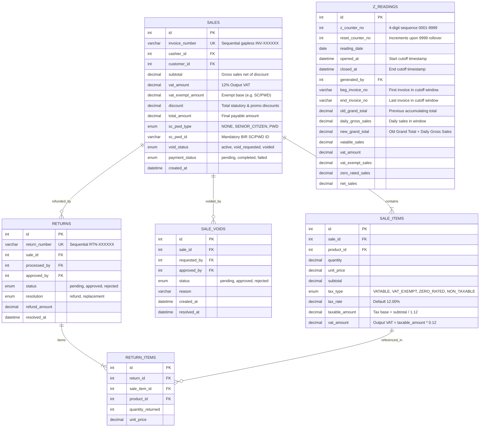
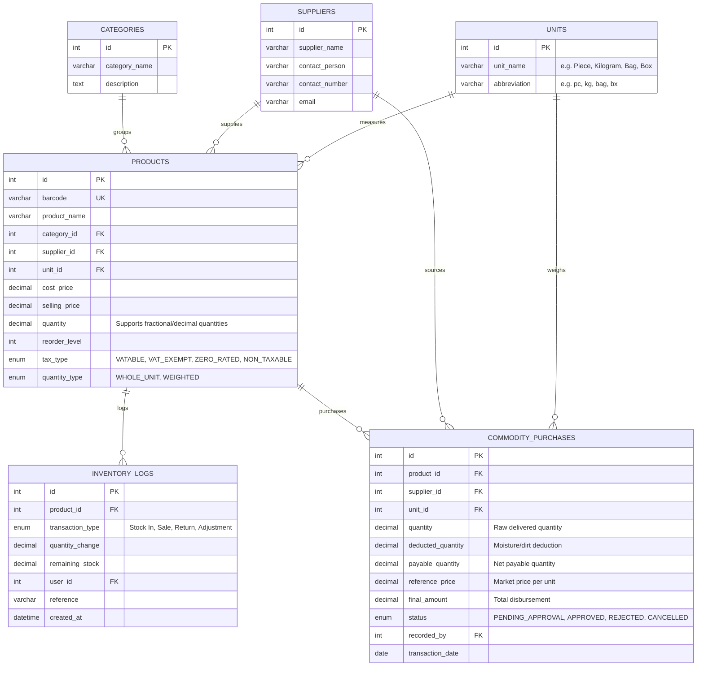
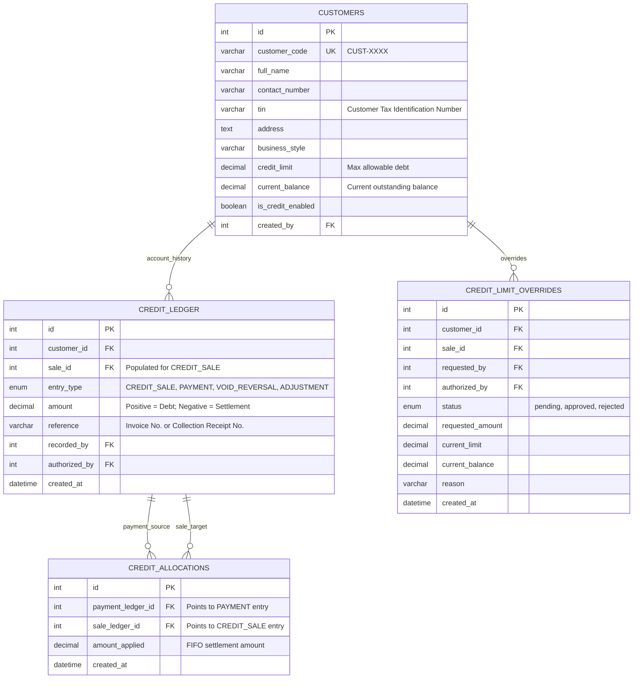
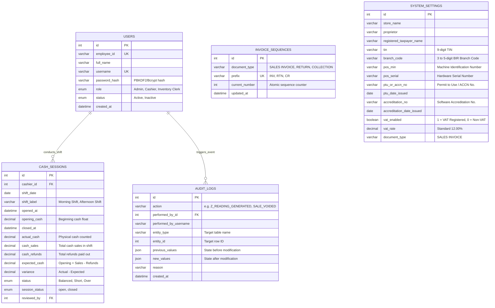

# ENTITY RELATIONSHIP DIAGRAM (ERD) & DATA DICTIONARY MANUAL
## ISRA Hardware POS & Inventory Management System (v1.0)
### Bureau of Internal Revenue (BIR) POS / CAS Accreditation & Technical Documentation

---

### DOCUMENT CONTROL

| Attribute | Details |
| :--- | :--- |
| **System Name** | ISRA Hardware POS & Inventory Management System |
| **Software Brand Name** | ISRA POS System v1.0 |
| **Database Engine** | MySQL 8.0+ / MariaDB (InnoDB Storage Engine) |
| **Schema Revision** | Revision 048 (BIR Fiscal & Audit Compliant) |
| **Character Set / Collation** | `utf8mb4` / `utf8mb4_unicode_ci` |
| **Document Purpose** | Official Entity Relationship Diagram (ERD) & Data Schema Specification for BIR CAS / POS Permit to Use (PTU) Submission |

---

## TABLE OF CONTENTS
1. [Master Unified Entity Relationship Diagram](#1-master-unified-entity-relationship-diagram)
2. [Domain-Specific Sub-Diagrams](#2-domain-specific-sub-diagrams)
   - 2.1 [Sales, Cashiering & Tax Compliance Domain](#21-sales-cashiering--tax-compliance-domain)
   - 2.2 [Inventory, Catalog & Commodity Purchasing Domain](#22-inventory-catalog--commodity-purchasing-domain)
   - 2.3 [Customer Accounts Receivable & Credit Ledger Domain](#23-customer-accounts-receivable--credit-ledger-domain)
   - 2.4 [Security, Cash Drawer Sessions & System Audit Domain](#24-security-cash-drawer-sessions--system-audit-domain)
3. [Comprehensive Data Dictionary](#3-comprehensive-data-dictionary)
4. [Relationship & Cardinality Matrix](#4-relationship--cardinality-matrix)
5. [Referential Integrity, Constraints & Immutability Triggers](#5-referential-integrity-constraints--immutability-triggers)

---

## 1. MASTER UNIFIED ENTITY RELATIONSHIP DIAGRAM

The following master diagram illustrates all primary database entities, relationships, cardinality, and foreign key linkages within the system:

```mermaid
erDiagram
    %% =========================================================================
    %% USERS & AUTHENTICATION
    %% =========================================================================
    USERS {
        int id PK
        varchar employee_id UK
        varchar full_name
        varchar username UK
        varchar password_hash
        enum role "Admin, Cashier, Inventory Clerk"
        enum status "Active, Inactive"
        datetime created_at
    }

    %% =========================================================================
    %% PRODUCT CATALOG & INVENTORY
    %% =========================================================================
    CATEGORIES {
        int id PK
        varchar category_name
        text description
    }

    UNITS {
        int id PK
        varchar unit_name
        varchar abbreviation
        varchar description
    }

    SUPPLIERS {
        int id PK
        varchar supplier_name
        varchar contact_person
        varchar contact_number
        varchar email
        enum status "Active, Inactive"
    }

    PRODUCTS {
        int id PK
        varchar barcode UK
        varchar product_name
        int category_id FK
        int supplier_id FK
        int unit_id FK
        decimal cost_price
        decimal selling_price
        decimal quantity
        int reorder_level
        enum tax_type "VATABLE, VAT_EXEMPT, ZERO_RATED, NON_TAXABLE"
        enum pricing_type "FIXED_PRICE, MARKET_BASED"
        enum quantity_type "WHOLE_UNIT, WEIGHTED"
        enum status "Active, Inactive"
    }

    INVENTORY_LOGS {
        int id PK
        int product_id FK
        enum transaction_type "Stock In, Sale, Return, Adjustment"
        decimal quantity_change
        decimal remaining_stock
        int user_id FK
        varchar reference
        datetime created_at
    }

    %% =========================================================================
    %% SALES & CASHIERING (BIR FISCAL CORE)
    %% =========================================================================
    DISCOUNTS {
        int id PK
        varchar discount_name
        enum discount_type "Percentage, Fixed"
        decimal value
        enum status "Active, Inactive"
    }

    PAYMENT_METHODS {
        int id PK
        varchar method_name
        boolean is_active
        boolean requires_reference
    }

    SALES {
        int id PK
        varchar invoice_number UK
        int cashier_id FK
        int customer_id FK
        varchar customer_name
        varchar customer_tin
        text customer_address
        varchar business_style
        decimal subtotal
        decimal vat_amount
        decimal vat_exempt_amount
        decimal discount
        decimal total_amount
        decimal cash_tendered
        decimal change_amount
        int payment_method_id FK
        enum payment_type "CASH, CREDIT"
        enum sc_pwd_type "NONE, SENIOR_CITIZEN, PWD"
        varchar sc_pwd_id
        enum void_status "active, void_requested, voided"
        enum payment_status "pending, completed, failed"
        datetime created_at
    }

    SALE_ITEMS {
        int id PK
        int sale_id FK
        int product_id FK
        decimal quantity
        decimal unit_price
        decimal subtotal
        enum tax_type "VATABLE, VAT_EXEMPT, ZERO_RATED, NON_TAXABLE"
        decimal tax_rate
        decimal taxable_amount
        decimal vat_amount
    }

    SALE_VOIDS {
        int id PK
        int sale_id FK
        int requested_by FK
        int approved_by FK
        enum status "pending, approved, rejected"
        varchar reason
        datetime created_at
        datetime resolved_at
    }

    RETURNS {
        int id PK
        varchar return_number UK
        int sale_id FK
        int processed_by FK
        int approved_by FK
        enum status "pending, approved, rejected"
        enum resolution "refund, replacement"
        decimal refund_amount
        varchar return_reason
        datetime created_at
        datetime resolved_at
    }

    RETURN_ITEMS {
        int id PK
        int return_id FK
        int sale_item_id FK
        int product_id FK
        int quantity_returned
        decimal unit_price
    }

    %% =========================================================================
    %% BIR FISCAL AUDIT & READINGS
    %% =========================================================================
    Z_READINGS {
        int id PK
        int z_counter_no
        int reset_counter_no
        date reading_date
        datetime opened_at
        datetime closed_at
        int generated_by FK
        varchar beg_invoice_no
        varchar end_invoice_no
        decimal old_grand_total
        decimal daily_gross_sales
        decimal new_grand_total
        decimal vatable_sales
        decimal vat_amount
        decimal vat_exempt_sales
        decimal zero_rated_sales
        decimal total_discounts
        decimal total_returns
        decimal total_voids
        decimal net_sales
        datetime created_at
    }

    CASH_SESSIONS {
        int id PK
        int cashier_id FK
        date shift_date
        varchar shift_label
        datetime opened_at
        decimal opening_cash
        datetime closed_at
        decimal actual_cash
        decimal cash_sales
        decimal cash_refunds
        decimal expected_cash
        decimal variance
        enum status "Balanced, Short, Over"
        enum session_status "open, closed"
        int reviewed_by FK
    }

    INVOICE_SEQUENCES {
        int id PK
        varchar document_type
        varchar prefix UK
        int current_number
        datetime updated_at
    }

    AUDIT_LOGS {
        int id PK
        varchar action
        int performed_by_id FK
        varchar performed_by_username
        varchar entity_type
        int entity_id
        json previous_values
        json new_values
        varchar reason
        datetime created_at
    }

    %% =========================================================================
    %% CUSTOMERS & CREDIT (UTANG)
    %% =========================================================================
    CUSTOMERS {
        int id PK
        varchar customer_code UK
        varchar full_name
        varchar contact_number
        varchar tin
        text address
        decimal credit_limit
        decimal current_balance
        boolean is_credit_enabled
        int created_by FK
    }

    CREDIT_LEDGER {
        int id PK
        int customer_id FK
        int sale_id FK
        enum entry_type "CREDIT_SALE, PAYMENT, VOID_REVERSAL, ADJUSTMENT"
        decimal amount
        varchar reference
        int recorded_by FK
        int authorized_by FK
        datetime created_at
    }

    CREDIT_ALLOCATIONS {
        int id PK
        int payment_ledger_id FK
        int sale_ledger_id FK
        decimal amount_applied
        datetime created_at
    }

    CREDIT_LIMIT_OVERRIDES {
        int id PK
        int customer_id FK
        int sale_id FK
        int requested_by FK
        int authorized_by FK
        enum status "pending, approved, rejected"
        decimal requested_amount
        decimal current_balance
        datetime created_at
    }

    %% =========================================================================
    %% COMMODITIES & PURCHASING
    %% =========================================================================
    COMMODITY_PURCHASES {
        int id PK
        int product_id FK
        int supplier_id FK
        int unit_id FK
        decimal quantity
        decimal deducted_quantity
        decimal payable_quantity
        decimal reference_price
        decimal final_amount
        enum status "PENDING_APPROVAL, APPROVED, REJECTED, CANCELLED"
        int prepared_by FK
        int approved_by FK
        int recorded_by FK
        date transaction_date
    }

    %% =========================================================================
    %% RELATIONSHIPS & CARDINALITY
    %% =========================================================================
    CATEGORIES ||--o{ PRODUCTS : "classifies"
    SUPPLIERS ||--o{ PRODUCTS : "supplies"
    UNITS ||--o{ PRODUCTS : "measures"

    PRODUCTS ||--o{ SALE_ITEMS : "sold_in"
    PRODUCTS ||--o{ INVENTORY_LOGS : "tracked_in"
    PRODUCTS ||--o{ RETURN_ITEMS : "returned_in"
    PRODUCTS ||--o{ COMMODITY_PURCHASES : "purchased_as"

    USERS ||--o{ SALES : "cashiers"
    USERS ||--o{ Z_READINGS : "generates"
    USERS ||--o{ CASH_SESSIONS : "operates"
    USERS ||--o{ AUDIT_LOGS : "performs"
    USERS ||--o{ CREDIT_LEDGER : "records"
    USERS ||--o{ CUSTOMERS : "creates"

    CUSTOMERS ||--o{ SALES : "places"
    CUSTOMERS ||--o{ CREDIT_LEDGER : "holds_account"
    CUSTOMERS ||--o{ CREDIT_LIMIT_OVERRIDES : "requests_override"

    SALES ||--|{ SALE_ITEMS : "contains"
    SALES ||--o{ SALE_VOIDS : "subject_to_void"
    SALES ||--o{ RETURNS : "subject_to_return"
    SALES ||--o{ CREDIT_LEDGER : "generates_debt"

    DISCOUNTS ||--o{ SALES : "applied_to"
    PAYMENT_METHODS ||--o{ SALES : "tendered_with"

    RETURNS ||--|{ RETURN_ITEMS : "includes"
    SALE_ITEMS ||--o{ RETURN_ITEMS : "item_returned"

    CREDIT_LEDGER ||--o{ CREDIT_ALLOCATIONS : "payment_applies"
    CREDIT_LEDGER ||--o{ CREDIT_ALLOCATIONS : "sale_settled"

    SUPPLIERS ||--o{ COMMODITY_PURCHASES : "supplies_commodity"
    UNITS ||--o{ COMMODITY_PURCHASES : "weighed_in"
```



---

## 2. DOMAIN-SPECIFIC SUB-DIAGRAMS

To provide crystal-clear architectural insight for the BIR assessment team, the database is partitioned into 4 core functional domains.

### 2.1 Sales, Cashiering & Tax Compliance Domain
This domain manages high-speed checkout, line-item tax snapshotting (VATable, Exempt, Zero-Rated), non-resettable daily Z-reading accumulation, supervisor void approval, and return processing.



---

### 2.2 Inventory, Catalog & Commodity Purchasing Domain
Manages stock master items, categories, measuring units, supplier relationships, warehouse movements, physical stock adjustments, and agricultural/hardware commodity purchases.



---

### 2.3 Customer Accounts Receivable & Credit Ledger Domain
Implements the customer credit ("Utang") ledger system adhering to double-entry audit principles, FIFO payment allocations, and supervisory credit limit overrides.



---

### 2.4 Security, Cash Drawer Sessions & System Audit Domain
Enforces Role-Based Access Control (RBAC), cashier shift float management, cash drawer reconciliations, and immutable audit event trails.



---

## 3. COMPREHENSIVE DATA DICTIONARY

### 3.1 `sales` (Primary Sales Header Table)
- **Engine**: InnoDB | **Primary Key**: `id` | **Immutability**: Enforced by Database Triggers

| Column Name | Data Type | Nullable | Default | Constraints / References | Description / BIR Audit Purpose |
| :--- | :--- | :---: | :---: | :--- | :--- |
| `id` | `INT` | NO | AUTO_INC | `PRIMARY KEY` | Unique internal transaction identifier. |
| `invoice_number` | `VARCHAR(30)` | YES | NULL | `UNIQUE KEY` | Official sequential gapless Sales Invoice Number (`INV-XXXXXX`). |
| `cashier_id` | `INT` | YES | NULL | `FK → users(id)` | User ID of the cashier who tendered the transaction. |
| `customer_id` | `INT` | YES | NULL | `FK → customers(id)` | Customer ID (for registered / credit accounts). |
| `customer_name` | `VARCHAR(150)`| YES | NULL | - | Buyer / Customer registered business name. |
| `customer_tin` | `VARCHAR(30)` | YES | NULL | - | Buyer's 9-digit TIN + Branch Code for corporate invoicing. |
| `customer_address`| `TEXT` | YES | NULL | - | Buyer's registered address. |
| `business_style` | `VARCHAR(100)`| YES | NULL | - | Buyer's line of business / industry style. |
| `subtotal` | `DECIMAL(10,2)`| YES | 0.00 | - | Gross sale total before tax segregation and discounts. |
| `vat_amount` | `DECIMAL(10,2)`| YES | 0.00 | - | 12% Output VAT collected on VATable line items. |
| `vat_exempt_amount`|`DECIMAL(10,2)`| YES | 0.00 | - | Sales amount exempted from VAT (e.g. SC/PWD purchases). |
| `discount` | `DECIMAL(10,2)`| YES | 0.00 | - | Total deductions applied (statutory SC/PWD or promotional). |
| `total_amount` | `DECIMAL(10,2)`| YES | 0.00 | - | Net payable total amount due. |
| `amount_received`| `DECIMAL(10,2)`| YES | 0.00 | - | Amount of money tendered by customer. |
| `change_amount` | `DECIMAL(10,2)`| YES | 0.00 | - | Change given back to customer. |
| `payment_method_id`|`INT` | YES | NULL | `FK → payment_methods(id)` | Method of payment (Cash, GCash, Card, Credit). |
| `payment_type` | `ENUM` | NO | 'CASH' | `'CASH', 'CREDIT'` | Billing classification of the invoice. |
| `sc_pwd_type` | `ENUM` | NO | 'NONE' | `'NONE', 'SENIOR_CITIZEN', 'PWD'` | Statutory tax exemption category. |
| `sc_pwd_id` | `VARCHAR(50)` | YES | NULL | - | Government-issued Senior Citizen / PWD ID Number. |
| `void_status` | `ENUM` | NO | 'active'| `'active', 'void_requested', 'voided'` | Post-tender void audit status. |
| `payment_status`| `ENUM` | NO | 'pending'| `'pending', 'completed', 'failed'` | ACID transaction crash recovery lifecycle state. |
| `created_at` | `TIMESTAMP` | NO | CURRENT_TIMESTAMP | `INDEX` | Exact date and time when the sale was finalized. |

---

### 3.2 `sale_items` (Line Item Detail Table)
- **Engine**: InnoDB | **Primary Key**: `id` | **Foreign Keys**: `sale_id`, `product_id`

| Column Name | Data Type | Nullable | Default | Constraints / References | Description / BIR Audit Purpose |
| :--- | :--- | :---: | :---: | :--- | :--- |
| `id` | `INT` | NO | AUTO_INC | `PRIMARY KEY` | Unique line item record ID. |
| `sale_id` | `INT` | NO | - | `FK → sales(id)` | Reference to parent sales transaction. |
| `product_id` | `INT` | NO | - | `FK → products(id)` | Reference to master product catalog item. |
| `quantity` | `DECIMAL(12,3)`| NO | 1.000 | - | Quantity purchased (supports whole and decimal units). |
| `unit_price` | `DECIMAL(10,2)`| NO | 0.00 | - | Unit selling price at the moment of sale. |
| `subtotal` | `DECIMAL(10,2)`| NO | 0.00 | - | Line gross total ($\text{quantity} \times \text{unit\_price}$). |
| `tax_type` | `ENUM` | NO | 'VATABLE'| `'VATABLE', 'VAT_EXEMPT', 'ZERO_RATED', 'NON_TAXABLE'` | Immutable tax classification at time of sale. |
| `tax_rate` | `DECIMAL(5,2)` | NO | 12.00 | - | VAT rate percentage applied (12.00%). |
| `taxable_amount`| `DECIMAL(10,2)`| NO | 0.00 | - | Tax base ($\text{subtotal} / 1.12$). |
| `vat_amount` | `DECIMAL(10,2)`| NO | 0.00 | - | Output VAT ($\text{taxable\_amount} \times 0.12$). |

---

### 3.3 `z_readings` (Non-Resettable Daily Fiscal Accumulator Table)
- **Engine**: InnoDB | **Primary Key**: `id` | **Audit Compliance**: Non-Volatile Fiscal Record

| Column Name | Data Type | Nullable | Default | Constraints / References | Description / BIR Audit Purpose |
| :--- | :--- | :---: | :---: | :--- | :--- |
| `id` | `INT` | NO | AUTO_INC | `PRIMARY KEY` | Internal chronological reading ID. |
| `z_counter_no` | `INT UNSIGNED` | NO | 1 | `INDEX` | Sequential 4-digit reading number (`0001` to `9999`). |
| `reset_counter_no`|`INT UNSIGNED`| NO | 0 | - | Increments by 1 every time Z-Counter rolls past 9999. |
| `reading_date` | `DATE` | NO | - | `INDEX` | Calendar date represented by the reading. |
| `opened_at` | `DATETIME` | NO | - | - | Starting timestamp cutoff (previous Z-reading close). |
| `closed_at` | `DATETIME` | NO | - | `INDEX` | Ending timestamp cutoff for the current reading. |
| `generated_by` | `INT` | NO | - | `FK → users(id)` | Admin / Supervisor who executed the daily close. |
| `beg_invoice_no`| `VARCHAR(50)` | YES | NULL | - | First Sales Invoice number in this reading window. |
| `end_invoice_no`| `VARCHAR(50)` | YES | NULL | - | Last Sales Invoice number in this reading window. |
| `beg_void_no` | `VARCHAR(50)` | YES | NULL | - | First sequential void ID in this reading window. |
| `end_void_no` | `VARCHAR(50)` | YES | NULL | - | Last sequential void ID in this reading window. |
| `beg_return_no`| `VARCHAR(50)` | YES | NULL | - | First Return Slip number in this reading window. |
| `end_return_no`| `VARCHAR(50)` | YES | NULL | - | Last Return Slip number in this reading window. |
| `old_grand_total`|`DECIMAL(14,2)`| NO | 0.00 | - | Cumulative Grand Total prior to this reading. |
| `daily_gross_sales`|`DECIMAL(12,2)`| NO | 0.00 | - | Gross sales generated within this reading cutoff. |
| `new_grand_total`|`DECIMAL(14,2)`| NO | 0.00 | - | Non-resettable Total ($\text{Old Grand} + \text{Daily Gross}$). |
| `vatable_sales`| `DECIMAL(12,2)`| NO | 0.00 | - | Cumulative daily VATable sales (tax base net of VAT). |
| `vat_amount` | `DECIMAL(12,2)`| NO | 0.00 | - | Cumulative daily 12% Output VAT collected. |
| `vat_exempt_sales`|`DECIMAL(12,2)`| NO | 0.00 | - | Cumulative daily VAT-exempt sales (including SC/PWD). |
| `zero_rated_sales`|`DECIMAL(12,2)`| NO | 0.00 | - | Cumulative daily Zero-Rated (0% VAT) sales. |
| `non_vat_sales`| `DECIMAL(12,2)`| NO | 0.00 | - | Cumulative daily Non-VAT sales. |
| `sc_discount` | `DECIMAL(12,2)`| NO | 0.00 | - | Total 20% discounts granted to Senior Citizens. |
| `pwd_discount` | `DECIMAL(12,2)`| NO | 0.00 | - | Total 20% discounts granted to PWDs. |
| `regular_discount`|`DECIMAL(12,2)`| NO | 0.00 | - | Total promotional & special discounts approved. |
| `total_discounts`|`DECIMAL(12,2)`| NO | 0.00 | - | Sum of all statutory and promotional deductions. |
| `total_returns` | `DECIMAL(12,2)`| NO | 0.00 | - | Total cash value of completed item returns/refunds. |
| `total_voids` | `DECIMAL(12,2)`| NO | 0.00 | - | Total value of post-tender voided sales. |
| `net_sales` | `DECIMAL(12,2)`| NO | 0.00 | - | Final Net Sales ($\text{Gross} - \text{Discounts} - \text{Returns} - \text{Voids}$). |
| `cash_sales` | `DECIMAL(12,2)`| NO | 0.00 | - | Total cash payments collected. |
| `credit_sales` | `DECIMAL(12,2)`| NO | 0.00 | - | Total sales charged to customer credit accounts. |
| `transaction_count`|`INT UNSIGNED`| NO | 0 | - | Total number of valid completed invoices. |
| `void_count` | `INT UNSIGNED` | NO | 0 | - | Total number of voided transactions. |
| `return_count` | `INT UNSIGNED` | NO | 0 | - | Total number of return transactions. |
| `created_at` | `DATETIME` | NO | CURRENT_TIMESTAMP | - | Exact timestamp of Z-Reading execution. |

---

### 3.4 `cash_sessions` (Cashier Shift & X-Reading Reconciliation Table)
- **Engine**: InnoDB | **Primary Key**: `id` | **Purpose**: Frontline Cash Accountability

| Column Name | Data Type | Nullable | Default | Constraints / References | Description |
| :--- | :--- | :---: | :---: | :--- | :--- |
| `id` | `INT` | NO | AUTO_INC | `PRIMARY KEY` | Unique shift session ID. |
| `cashier_id` | `INT` | NO | - | `FK → users(id)` | Cashier assigned to the cash drawer. |
| `shift_date` | `DATE` | NO | - | `INDEX` | Date of shift operation. |
| `shift_label` | `VARCHAR(50)` | NO | 'Day Shift' | - | Shift designation (e.g., Morning, Afternoon). |
| `opened_at` | `DATETIME` | NO | CURRENT_TIMESTAMP | - | Shift opening timestamp. |
| `opening_cash` | `DECIMAL(12,2)`| NO | 0.00 | - | Beginning cash float provided to cashier. |
| `closed_at` | `DATETIME` | YES | NULL | - | Shift closing timestamp. |
| `actual_cash` | `DECIMAL(12,2)`| YES | NULL | - | Physical cash counted and declared by cashier. |
| `cash_sales` | `DECIMAL(12,2)`| YES | NULL | - | System-computed sum of cash sales during shift. |
| `cash_refunds` | `DECIMAL(12,2)`| YES | NULL | - | Cash refunds disbursed by cashier. |
| `expected_cash`| `DECIMAL(12,2)`| YES | NULL | - | Formula: $\text{Opening} + \text{Cash Sales} - \text{Refunds}$. |
| `variance` | `DECIMAL(12,2)`| YES | NULL | - | Cash discrepancy ($\text{Actual Cash} - \text{Expected Cash}$). |
| `status` | `ENUM` | YES | NULL | `'Balanced', 'Short', 'Over'` | Audit status based on cash variance. |
| `session_status`|`ENUM` | NO | 'open' | `'open', 'closed'` | Shift active lifecycle status. |
| `reviewed_by` | `INT` | YES | NULL | `FK → users(id)` | Supervisor/Admin who audited the shift close. |

---

### 3.5 `audit_logs` (Security & Transaction Audit Trail Table)
- **Engine**: InnoDB | **Primary Key**: `id` | **Compliance**: BIR Complete Electronic Audit Trail

| Column Name | Data Type | Nullable | Default | Constraints / References | Description |
| :--- | :--- | :---: | :---: | :--- | :--- |
| `id` | `INT` | NO | AUTO_INC | `PRIMARY KEY` | Chronological audit entry number. |
| `action` | `VARCHAR(64)` | NO | - | `INDEX` | Action code (e.g. `LOGIN`, `Z_READING_GENERATED`). |
| `performed_by_id`|`INT` | NO | - | `FK → users(id)` | User ID who initiated the event. |
| `performed_by_username`|`VARCHAR(255)`| NO | - | - | Snapshot of username at time of event. |
| `target_user_id`|`INT` | YES | NULL | `FK → users(id)` | User affected (for user management actions). |
| `entity_type` | `VARCHAR(64)` | YES | NULL | `INDEX` | Target database table (e.g. `sales`, `z_readings`). |
| `entity_id` | `INT` | YES | NULL | - | Primary key ID of affected record. |
| `previous_values`|`JSON` | YES | NULL | - | JSON snapshot of data before modification. |
| `new_values` | `JSON` | YES | NULL | - | JSON snapshot of data after modification. |
| `reason` | `VARCHAR(500)`| YES | NULL | - | Justification notes (for voids, price overrides). |
| `created_at` | `DATETIME` | NO | CURRENT_TIMESTAMP | `INDEX` | Precise event timestamp. |

---

### 3.6 `system_settings` (BIR Machine & Taxpayer Configuration)
- **Engine**: InnoDB | **Primary Key**: `id` | **Constraint**: Singleton (`id = 1`)

| Column Name | Data Type | Nullable | Default | Description / BIR Permit Parameters |
| :--- | :--- | :---: | :---: | :--- |
| `id` | `INT` | NO | 1 | Primary key singleton configuration row. |
| `store_name` | `VARCHAR(150)`| YES | '' | Registered Commercial Trade Name. |
| `proprietor` | `VARCHAR(150)`| YES | '' | Name of Registered Business Proprietor. |
| `registered_taxpayer_name`|`VARCHAR(200)`| YES | '' | Legal Taxpayer Name on BIR Certificate of Registration (COR). |
| `tin` | `VARCHAR(30)` | YES | '' | 9-digit Taxpayer Identification Number. |
| `branch_code` | `VARCHAR(10)` | NO | '00000' | 3 to 5-digit BIR Registered Branch Code (e.g., `00000` for Head Office). |
| `address` | `TEXT` | YES | NULL | Official Registered Business Address. |
| `contact_number`| `VARCHAR(20)` | YES | '' | Telephone / Mobile number. |
| `pos_min` | `VARCHAR(30)` | YES | '' | Machine Identification Number (MIN) issued by BIR. |
| `pos_serial` | `VARCHAR(30)` | YES | '' | Machine Hardware Serial Number (S/N). |
| `ptu_or_accn_no`| `VARCHAR(100)`| YES | NULL | BIR Permit to Use (PTU) or Acknowledgment Certificate No. |
| `ptu_date_issued`| `DATE` | YES | NULL | Date when BIR PTU was officially granted. |
| `accreditation_no`|`VARCHAR(100)`| NO | '000-000000000-000000' | POS Software Accreditation Number. |
| `accreditation_date_issued`|`DATE`| YES | NULL | Date when POS Software Accreditation was issued. |
| `vat_enabled` | `TINYINT(1)` | NO | 1 | `1` = VAT Registered Taxpayer (12%), `0` = Non-VAT Taxpayer. |
| `document_type` | `VARCHAR(60)` | NO | 'SALES INVOICE' | Header document title (`SALES INVOICE` / `OFFICIAL RECEIPT`). |

---

## 4. RELATIONSHIP & CARDINALITY MATRIX

| Parent Entity | Relationship | Child Entity | Foreign Key Column | Business Rule & Integrity Rationale |
| :--- | :---: | :--- | :--- | :--- |
| `users` | 1 to Many ($1:N$) | `sales` | `sales.cashier_id` | A cashier can process multiple sales invoices. |
| `sales` | 1 to Many ($1:N$) | `sale_items` | `sale_items.sale_id` | Every sale contains 1 or more line items (`CASCADE` prohibited on completed sales). |
| `products` | 1 to Many ($1:N$) | `sale_items` | `sale_items.product_id` | Master catalog items can be sold across multiple transactions. |
| `categories` | 1 to Many ($1:N$) | `products` | `products.category_id` | Product categorization and hierarchical inventory structure. |
| `suppliers` | 1 to Many ($1:N$) | `products` | `products.supplier_id` | Primary wholesale vendor supplying the product. |
| `units` | 1 to Many ($1:N$) | `products` | `products.unit_id` | Unit of measure (piece, kg, bag, meter, box). |
| `sales` | 1 to 0..1 ($1:0..1$) | `sale_voids` | `sale_voids.sale_id` | A completed sale may have an associated void audit record. |
| `sales` | 1 to Many ($1:N$) | `returns` | `returns.sale_id` | A sale invoice may have one or more return/exchange events. |
| `returns` | 1 to Many ($1:N$) | `return_items` | `return_items.return_id` | Return slip specifies exact line items returned. |
| `customers` | 1 to Many ($1:N$) | `sales` | `sales.customer_id` | Customers can perform cash or charge sales. |
| `customers` | 1 to Many ($1:N$) | `credit_ledger`| `credit_ledger.customer_id` | Running accounts receivable ("Utang") ledger. |
| `credit_ledger`| 1 to Many ($1:N$) | `credit_allocations`| `credit_allocations.payment_ledger_id` | FIFO matching of cash payments against outstanding charge invoices. |
| `users` | 1 to Many ($1:N$) | `cash_sessions`| `cash_sessions.cashier_id` | Shifts conducted by cashiers with cash float auditing. |
| `users` | 1 to Many ($1:N$) | `z_readings` | `z_readings.generated_by` | Authorized Admin/Supervisor who generates the End-of-Day Z-Reading. |
| `users` | 1 to Many ($1:N$) | `audit_logs` | `audit_logs.performed_by_id`| System operator responsible for logged security/financial actions. |

---

## 5. REFERENTIAL INTEGRITY, CONSTRAINTS & IMMUTABILITY TRIGGERS

### 5.1 Database Triggers Enforcing BIR Sales Immutability

Under BIR Regulations (**RR 11-2004**, **RMC 64-2023**), once a transaction is finalized, it must become strictly immutable. Hard deletion (`DELETE`) and backdoor financial adjustments (`UPDATE`) are blocked at the MySQL storage engine layer via triggers:

```sql
-- 1. Hard Delete Prevention Trigger on sales table
DELIMITER //
CREATE TRIGGER trg_prevent_sales_delete
BEFORE DELETE ON sales
FOR EACH ROW
BEGIN
  SIGNAL SQLSTATE '45000'
    SET MESSAGE_TEXT = 'BIR Compliance Error: HARD DELETES are prohibited on the sales table. Use void workflow instead.';
END //
DELIMITER ;

-- 2. Hard Delete Prevention Trigger on sale_items table
DELIMITER //
CREATE TRIGGER trg_prevent_sale_items_delete
BEFORE DELETE ON sale_items
FOR EACH ROW
BEGIN
  SIGNAL SQLSTATE '45000'
    SET MESSAGE_TEXT = 'BIR Compliance Error: HARD DELETES are prohibited on the sale_items table.';
END //
DELIMITER ;

-- 3. Backdoor Modification Prevention Trigger on sales table
DELIMITER //
CREATE TRIGGER trg_protect_sales_financial_data
BEFORE UPDATE ON sales
FOR EACH ROW
BEGIN
  -- Prohibit alteration of Invoice Number once assigned
  IF (OLD.invoice_number IS NOT NULL AND NEW.invoice_number != OLD.invoice_number) THEN
    SIGNAL SQLSTATE '45000'
      SET MESSAGE_TEXT = 'BIR Compliance Error: invoice_number cannot be modified.';
  END IF;

  -- Prohibit alteration of sales amounts, VAT, discounts, or dates on completed transactions
  IF (OLD.payment_status = 'completed' AND (
      NEW.subtotal != OLD.subtotal OR
      NEW.vat_amount != OLD.vat_amount OR
      NEW.total_amount != OLD.total_amount OR
      NEW.discount != OLD.discount OR
      NEW.created_at != OLD.created_at
  )) THEN
    SIGNAL SQLSTATE '45000'
      SET MESSAGE_TEXT = 'BIR Compliance Error: Alteration of recorded sales amounts or dates on finalized sales is strictly prohibited.';
  END IF;
END //
DELIMITER ;
```

---

### OFFICIAL CERTIFICATION

This Entity Relationship Diagram (ERD) and Data Dictionary Document accurately represents the active relational schema, table structures, foreign key constraints, and fiscal triggers deployed in the **ISRA Hardware POS & Inventory Management System (v1.0)**.

**Submitted by:**

\
__________________________________________  
**Juan Dela Cruz**  
Proprietor / System Administrator  
ISRA Hardware Trading  
Date: August 25, 2026
