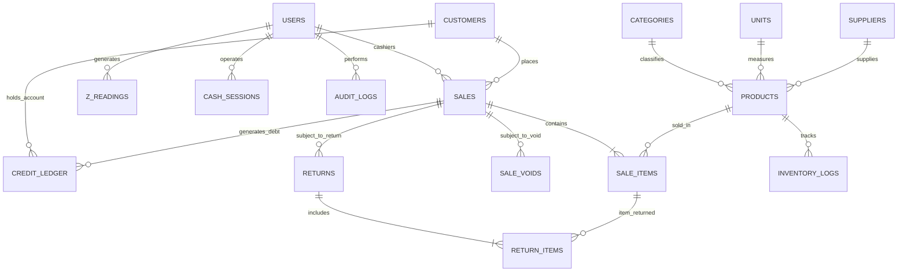
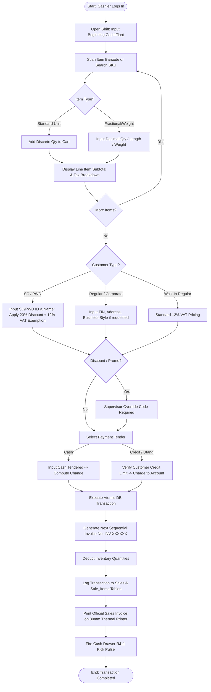
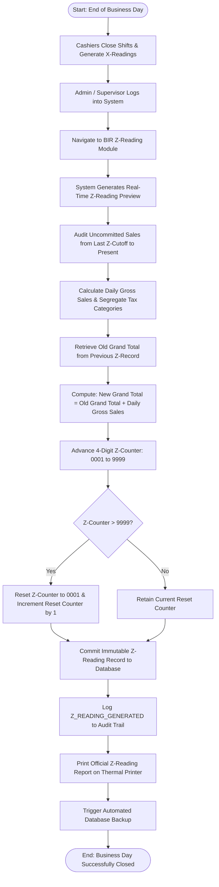
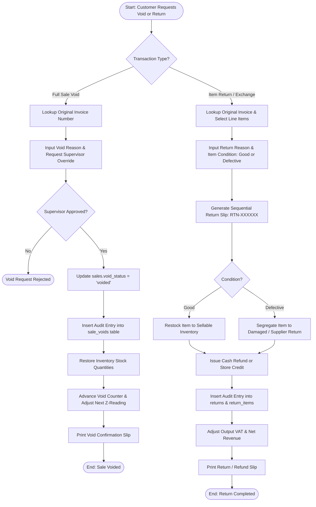

# SYSTEM DESCRIPTION MANUAL & TECHNICAL SPECIFICATIONS
## Bureau of Internal Revenue (BIR) POS / CAS Permit to Use (PTU) Compliance Document

---

### DOCUMENT CONTROL & SYSTEM IDENTIFICATION

| Attribute | Details |
| :--- | :--- |
| **System / Application Name** | ISRA Hardware POS & Inventory Management System |
| **Software Brand Name** | ISRA POS System v1.0 |
| **Software Version** | Version 1.0 (Database Schema Revision 048) |
| **Software Type** | Point-of-Sale (POS) & Computerized Cashiering System with Integrated Inventory and Tax Accounting |
| **Developer / Proponent** | In-House Software Engineering / ISRA Hardware Trading |
| **Industry / Business Sector** | Retail & Wholesale Construction Supplies, General Hardware, and Merchandising |
| **Target OS / Environment** | Microsoft Windows 10 / Windows 11 (64-bit) – Desktop & Touchscreen Kiosk Mode |
| **Database Management System** | MySQL Server 8.0+ / MariaDB (InnoDB Storage Engine, UTF-8 MB4 Unicode) |
| **Intended BIR Submission** | BIR Form 1907 / Application for Permit to Use (PTU) / CAS Accreditation Checklist |

---

## TABLE OF CONTENTS
1. [General Overview and Purpose of the System](#1-general-overview-and-purpose-of-the-system)
2. [Hardware & Software Specifications](#2-hardware--software-specifications)
3. [System Architecture & Network Topology](#3-system-architecture--network-topology)
4. [Database Architecture & Security Immutability](#4-database-architecture--security-immutability)
5. [Core Functional Modules](#5-core-functional-modules)
   - 5.1 [Point of Sale (POS) Cashiering & Transaction Processing](#51-point-of-sale-pos-cashiering--transaction-processing)
   - 5.2 [Tax Computation Engine (12% VAT, VAT-Exempt, Zero-Rated)](#52-tax-computation-engine-12-vat-vat-exempt-zero-rated)
   - 5.3 [Statutory Discounts (Senior Citizen & PWD) & Promotional Discounts](#53-statutory-discounts-senior-citizen--pwd--promotional-discounts)
   - 5.4 [Payment Tenders & Customer Credit ("Utang") Accounting](#54-payment-tenders--customer-credit-utang-accounting)
   - 5.5 [Void, Cancellation, and Return/Refund Procedures](#55-void-cancellation-and-returnrefund-procedures)
   - 5.6 [Shift Management, Cash Reconciliation & X-Reading](#56-shift-management-cash-reconciliation--x-reading)
   - 5.7 [End-of-Day Cutoff & Z-Reading Processing](#57-end-of-day-cutoff--z-reading-processing)
6. [BIR Compliance & Audit Capabilities](#6-bir-compliance--audit-capabilities)
   - 6.1 [Sequential Gapless Invoice Generation](#61-sequential-gapless-invoice-generation)
   - 6.2 [Non-Resettable Cumulative Grand Total Accumulator](#62-non-resettable-cumulative-grand-total-accumulator)
   - 6.3 [Official Sales Invoice / Cash Receipt Layout](#63-official-sales-invoice--cash-receipt-layout)
   - 6.4 [X-Reading Report (Shift Reading) Layout](#64-x-reading-report-shift-reading-layout)
   - 6.5 [Z-Reading Report (Daily Reading) Layout](#65-z-reading-report-daily-reading-layout)
   - 6.6 [BIR Monthly eSales Export (CSV Generation)](#66-bir-monthly-esales-export-csv-generation)
   - 6.7 [Comprehensive Audit Trail & System Activity Logging](#67-comprehensive-audit-trail--system-activity-logging)
7. [System Security, User Roles & Access Control](#7-system-security-user-roles--access-control)
8. [Data Backup, Archival & Disaster Recovery Procedures](#8-data-backup-archival--disaster-recovery-procedures)
9. [Process Flowcharts & System Diagrams](#9-process-flowcharts--system-diagrams)

---

## 1. GENERAL OVERVIEW AND PURPOSE OF THE SYSTEM

The **ISRA Hardware POS & Inventory Management System** (v1.1.0) is a dedicated computerized Point-of-Sale, Inventory Management, and Accounting software designed specifically for retail and wholesale hardware stores, lumber yards, and general merchandising establishments.

The system automates checkout transactions, real-time inventory adjustments, cash drawer auditing, accounts receivable ("Utang") ledgers, and comprehensive tax compliance tracking in full adherence to the statutory regulations prescribed by the **Bureau of Internal Revenue (BIR)** of the Philippines, including:
- **National Internal Revenue Code (NIRC)** of 1997, as amended (Tax Reform for Acceleration and Inclusion - TRAIN Law, and CREATE Act).
- **Revenue Regulations (RR) No. 11-2004** – Consolidated Regulations on Computerized Accounting System (CAS) and Point-of-Sale (POS) Machines.
- **Revenue Regulations (RR) No. 10-2015** – Use of Sales Invoices / Official Receipts generated by POS / CAS.
- **Revenue Memorandum Order (RMO) No. 10-2005 & RMO No. 27-2017** – Policies and Procedures in the Accreditation and Issuance of Permit to Use (PTU).
- **Revenue Memorandum Circular (RMC) No. 30-2023 & RMC No. 64-2023** – Updated Technical and Security Requirements for POS Machines, E-Invoicing, and Fiscal Accumulator Verification.

### Primary Objectives:
1. **Accurate Tax Assessment**: Real-time segregation and calculation of 12% Output VAT, VAT-Exempt sales, Zero-Rated sales, and Non-VAT sales on every transaction line item.
2. **Statutory Exemption & Discount Handling**: Automated application of 20% discounts and 12% VAT exemption for Senior Citizens (RA 9994) and Persons with Disability (RA 10754) with mandatory ID capture.
3. **Data Integrity & Non-Resettable Accumulators**: Continuous, non-volatile accumulation of cumulative grand totals that cannot be reset, altered, or backtracked.
4. **Audit Trail Accountability**: Complete immutability of recorded sales records through database triggers preventing unauthorized modification or hard deletion.
5. **Standardized BIR Reporting**: Automated generation of Sales Invoices, Shift X-Readings, Daily Z-Readings, Sales Journals, and official monthly BIR eSales CSV files.

---

## 2. HARDWARE & SOFTWARE SPECIFICATIONS

### 2.1 Minimum and Recommended Hardware Specifications

| Component | Minimum Specification | Recommended Specification |
| :--- | :--- | :--- |
| **Processor (CPU)** | Intel Core i3 (6th Gen) / AMD Ryzen 3 | Intel Core i5 (8th Gen or higher) / AMD Ryzen 5 |
| **System Memory (RAM)** | 4 GB DDR4 | 8 GB or 16 GB DDR4/DDR5 |
| **Primary Storage** | 128 GB Solid State Drive (SSD) | 256 GB NVMe M.2 Solid State Drive |
| **Display Monitor** | 15.6" LCD/LED (1366 x 768 resolution) | 19.5" or 21.5" Full HD (1920 x 1080) Touchscreen Display |
| **Secondary Display** | Optional / Not Required | Dual Screen Customer-Facing Display (HDMI) |
| **Receipt Printer** | 80mm Direct Thermal ESC/POS Printer (USB / Serial / Virtual COM) | 80mm High-Speed ESC/POS Thermal Printer (e.g., Xprinter XP-N160II / XP-C300H / Epson TM-T88) |
| **Barcode Label Printer**| 58mm / 30x20mm TSPL Direct Thermal Printer | Xprinter XP-365B / XP-235B Barcode Label Printer |
| **Barcode Scanner** | 1D Handheld USB Laser Scanner | 1D/2D High-Speed Omnidirectional USB/Wireless Scanner |
| **Electronic Cash Drawer**| RJ11 12V/24V Solenoid Cash Drawer | RJ11 Heavy-Duty Cash Drawer (Connected via Receipt Printer Kick-out Port) |
| **Network Interface** | 100 Mbps Fast Ethernet | 1 Gbps Gigabit LAN Ethernet / Dual-Band Wi-Fi 5 |
| **Power Backup** | 650 VA Uninterruptible Power Supply (UPS) | 1000 VA Line-Interactive UPS with Surge Suppression |

### 2.2 Software Environment & Technology Stack

| Layer | Technology | Details / Version |
| :--- | :--- | :--- |
| **Operating System** | Microsoft Windows 10 / 11 Pro (64-bit) | Supports Dedicated Kiosk Shell and Background Services |
| **Frontend Framework** | React 19 / TypeScript / Vite | Single Page Application (SPA) with Radix UI and Tailwind CSS |
| **Backend Runtime** | Node.js (v20 LTS or higher) | High-performance asynchronous event-driven I/O |
| **Application Server** | Express.js (v4.21.2) | RESTful API Server & Real-time WebSocket Gateway (`ws` v8.21) |
| **Database Engine** | MySQL Server 8.0+ / MariaDB | Relational Database with InnoDB engine, ACID transactions |
| **Database Driver** | `mysql2` (v3.23.0) | Prepared statements and binary protocol connection pooling |
| **Service Supervisor** | NSSM (Non-Sucking Service Manager) | Windows Service wrapper ensuring 99.9% uptime & auto-restart |
| **Direct Printing Engine**| WebSerial API & Native Print Agent | Direct ESC/POS binary socket and silent HTML rasterizer |
| **Security / Cryptography**| `bcryptjs` (v3.0.3) / `jsonwebtoken` (v9.0.3) | SHA-256 / PBKDF2 password hashing & signed token validation |

---

## 3. SYSTEM ARCHITECTURE & NETWORK TOPOLOGY

The system utilizes a hybrid Client-Server and Multi-Terminal Local Area Network (LAN) architecture with support for standalone kiosk operations.

```
 +─────────────────────────────────────────────────────────────────────────+
 │                       LOCAL AREA NETWORK (INTRANET)                    │
 │                                                                         │
 │  +─────────────────────────+              +──────────────────────────+  │
 │  │   POS CASHIER TERMINAL  │              │  SUPERVISOR / ADMIN PC   │  │
 │  │   (React 19 Kiosk UI)   │              │  (Back-Office Dashboard) │  │
 │  +────────────┬────────────+              +─────────────┬────────────+  │
 │               │                                         │               │
 │               │ HTTP / WebSocket (Port 5000)            │ HTTP (REST)   │
 │               ▼                                         ▼               │
 │  +───────────────────────────────────────────────────────────────────+  │
 │  │                CENTRAL POS APPLICATION SERVER                     │  │
 │  │                (Node.js / Express.js / TypeScript)                │  │
 │  │                                                                   │  │
 │  │  • Authentication & RBAC        • Tax Calculation Engine          │  │
 │  │  • Cashier Session Service      • Z-Reading & eSales Aggregator   │  │
 │  │  • Inventory & Units Engine     • Audit Trail Logger              │  │
 │  +──────────────────────────────────┬────────────────────────────────+  │
 │                                     │                                   │
 │                                     │ Connection Pool (Port 3306)       │
 │                                     ▼                                   │
 │  +───────────────────────────────────────────────────────────────────+  │
 │  │               MYSQL 8.0 RELATIONAL DATABASE ENGINE                │  │
 │  │               (InnoDB Storage Engine - ACID Compliant)            │  │
 │  │                                                                   │  │
 │  │  • Immutable Sales Records      • Non-Resettable Z-Readings       │  │
 │  │  • Database Triggers            • Activity & Security Audit Logs  │  │
 │  +───────────────────────────────────────────────────────────────────+  │
 +─────────────────────────────────────────────────────────────────────────+
                                       │
                         Direct ESC/POS / WebSerial
                                       ▼
  +────────────────────────────────────────────────────────────────────────+
  │                           HARDWARE PERIPHERALS                         │
  │  • 80mm ESC/POS Receipt Printer (Xprinter XP-N160II / XP-C300H)        │
  │  • 30x20mm Barcode Label Printer (Xprinter XP-365B)                    │
  │  • RJ11 Automatic Kick-Out Cash Drawer                                 │
  │  • USB 1D/2D Barcode Scanner                                           │
  +────────────────────────────────────────────────────────────────────────+
```

### Printing Subsystems:
1. **WebSerial Direct Communication**: Communicates directly from browser context to USB/Serial COM thermal printers without intermediate print dialogs.
2. **Local Print Agent Daemon**: A background service listening on `localhost:9123` executing direct raw ESC/POS byte sequences for cash drawer firing and instant receipt cuts.
3. **HTML Silent Rasterizer**: Secondary print fall-back utilizing Chrome Kiosk silent printing (`--kiosk-printing`) targeting default Windows ESC/POS drivers.

---

## 4. DATABASE ARCHITECTURE & SECURITY IMMUTABILITY

The underlying database uses the MySQL **InnoDB** storage engine to guarantee full Atomicity, Consistency, Isolation, and Durability (ACID).

### 4.1 Key Database Tables

| Table Name | Description | Key Fields & Audit Columns |
| :--- | :--- | :--- |
| `system_settings` | Machine identification, TIN, Branch code, MIN, Serial No, PTU No, Accreditation No. | `tin`, `branch_code`, `pos_min`, `pos_serial`, `ptu_or_accn_no`, `accreditation_no`, `vat_enabled` |
| `users` | User credentials, roles, full names, active statuses. | `id`, `username`, `password_hash`, `role`, `status` |
| `products` | Master list of items, SKUs, barcodes, tax classification, cost, selling price. | `id`, `barcode`, `product_name`, `tax_type`, `unit_price`, `cost_price`, `stock_quantity` |
| `sales` | Master sales transaction table (Immutable). | `id`, `invoice_number`, `subtotal`, `vat_amount`, `vat_exempt_amount`, `total_amount`, `payment_status`, `sc_pwd_type`, `sc_pwd_id`, `created_at` |
| `sale_items` | Line-item breakdown per sale with immutable snapshot of tax classification. | `id`, `sale_id`, `product_id`, `quantity`, `unit_price`, `tax_type`, `tax_rate`, `taxable_amount`, `vat_amount`, `subtotal` |
| `z_readings` | Non-resettable daily Z-reading audit records. | `id`, `z_counter_no`, `reset_counter_no`, `reading_date`, `old_grand_total`, `daily_gross_sales`, `new_grand_total`, `beg_invoice_no`, `end_invoice_no` |
| `cash_sessions` | Cashier shifts, beginning cash float, mid-shift reconciliations, end-of-shift X-readings. | `id`, `cashier_id`, `opening_cash`, `actual_cash`, `expected_cash`, `variance`, `opened_at`, `closed_at` |
| `sale_voids` | Audit records for canceled/voided transactions. | `id`, `sale_id`, `requested_by`, `approved_by`, `reason`, `status`, `resolved_at` |
| `returns` | Product returns, exchanges, and cash refund adjustments. | `id`, `return_number`, `sale_id`, `refund_amount`, `return_reason`, `resolved_by`, `resolved_at` |
| `credit_ledger` | Accounts receivable ledger ("Utang") tracking customer balances and collections. | `id`, `customer_id`, `sale_id`, `entry_type`, `amount`, `balance_after`, `recorded_by` |
| `audit_logs` | Comprehensive security and operational event log. | `id`, `action`, `performed_by_id`, `performed_by_username`, `entity_type`, `entity_id`, `previous_values`, `new_values`, `created_at` |
| `invoice_sequences`| Atomic locking sequence generator ensuring continuous gapless numbering. | `id`, `document_type`, `prefix`, `current_number`, `updated_at` |

### 4.2 Database-Level Immutability & Anti-Tampering Triggers

To strictly comply with BIR requirements prohibiting the deletion, modification, or backdating of finalized sales transactions, the database enforces database-level triggers (`047_bir_database_immutability_triggers.sql`):

1. **Trigger: `trg_prevent_sales_delete`**
   - Intercepts any SQL `DELETE` command executed against the `sales` table.
   - Throws a fatal SQL error (`SQLSTATE 45000`): *"BIR Compliance Error: HARD DELETES are prohibited on the sales table. Use void workflow instead."*
2. **Trigger: `trg_prevent_sale_items_delete`**
   - Intercepts any SQL `DELETE` command executed against the `sale_items` table.
   - Throws a fatal SQL error (`SQLSTATE 45000`): *"BIR Compliance Error: HARD DELETES are prohibited on the sale_items table."*
3. **Trigger: `trg_protect_sales_financial_data`**
   - Intercepts any SQL `UPDATE` command on the `sales` table.
   - Prohibits altering the `invoice_number` once generated.
   - Prohibits modifying `subtotal`, `vat_amount`, `total_amount`, `discount`, or `created_at` once `payment_status` is `'completed'`.
   - Throws a fatal SQL error (`SQLSTATE 45000`): *"BIR Compliance Error: Alteration of recorded sales amounts or dates on finalized sales is strictly prohibited."*

### 4.3 Entity Relationship Diagram (ERD) Summary

The relational structure enforces strict foreign key constraints across the Sales, Product Catalog, Customer Credit, and Fiscal Audit domains. A full comprehensive Data Dictionary and sub-domain diagrams are documented in **[ENTITY_RELATIONSHIP_DIAGRAM.md](file:///c:/Users/USER/Documents/POS%20System/docs/ENTITY_RELATIONSHIP_DIAGRAM.md)**.



---

## 5. CORE FUNCTIONAL MODULES

### 5.1 Point of Sale (POS) Cashiering & Transaction Processing
- **Barcode & SKU Lookup**: Automatic item recognition via barcode scanner or search query.
- **Unit Conversion & Decimal Quantities**: Supports discrete pieces, fractional/decimal quantities (e.g., kilograms for gravel/sand, meters for electrical wires/pipes), and packaging unit breakdowns (e.g., box to pieces).
- **Customer Information Tagging**: Mandatory capture of Customer Name, TIN, Address, and Business Style for corporate buyers, institutional clients, and transactions requiring official tax documentation.
- **Suspended / Held Transactions**: Cashiers can hold an incomplete transaction in temporary memory and recall it later without generating an invoice gap or locking up the register.

### 5.2 Tax Computation Engine (12% VAT, VAT-Exempt, Zero-Rated)
The system contains an automated tax calculation engine operating according to the following mathematical formulas:

1. **VATable Sales (12% Output VAT Inclusive)**:
   $$\text{Taxable Net Amount (VATable Sales)} = \frac{\text{Gross Selling Price}}{1.12}$$
   $$\text{Output VAT Amount (12\%)} = \text{Gross Selling Price} - \text{Taxable Net Amount} = \text{Taxable Net Amount} \times 0.12$$
2. **VAT-Exempt Sales**:
   $$\text{Output VAT Amount} = \text{PHP } 0.00 \quad (\text{Entire amount posted to VAT-Exempt base})$$
3. **Zero-Rated Sales (0% VAT)**:
   $$\text{Output VAT Amount} = \text{PHP } 0.00 \quad (\text{Entire amount posted to Zero-Rated base})$$
4. **Non-VAT Registered Mode**:
   If the taxpayer is non-VAT registered, the system disables Output VAT calculation and posts total sales to Non-VAT Sales, printing `"NON-VAT REG TIN"` on receipt headers.

### 5.3 Statutory Discounts (Senior Citizen & PWD) & Promotional Discounts
In compliance with **Republic Act No. 9994** (Expanded Senior Citizens Act) and **Republic Act No. 10754** (An Act Expanding the Benefits and Privileges of PWDs):

1. **SC / PWD Computation Logic**:
   - The gross purchase of covered basic goods is first stripped of the 12% VAT:
     $$\text{VAT-Exempt Base} = \frac{\text{Gross Amount}}{1.12}$$
   - The 20% statutory discount is applied strictly to the VAT-Exempt Base:
     $$\text{SC/PWD Discount (20\%)} = \text{VAT-Exempt Base} \times 0.20$$
     $$\text{Final Net Amount Due} = \text{VAT-Exempt Base} - \text{SC/PWD Discount}$$
   - The transaction is classified under **VAT-Exempt Sales**, Output VAT is recorded as **0.00**, and the customer's Senior Citizen / PWD ID Number and Full Name are permanently recorded.
2. **Promotional & Custom Discounts**:
   - Fixed or percentage discounts require **Manager Authorization Code** approval.
   - Authorizations generate a sequential authorization audit code (`AUTH-XXXXXX`) tracked in the `authorization_history` and `audit_logs` tables.

### 5.4 Payment Tenders & Customer Credit ("Utang") Accounting
- **Cash Tender**: Captures Cash Tendered, calculates exact Change Due, and sends kick-drawer signal.
- **Customer Credit / Charge Invoices ("Utang")**:
  - Validates customer credit limit and outstanding balance.
  - Supports optional Cash Down Payment at time of purchase.
  - Updates customer's balance in the `customer_credit_profiles` and appends an immutable debit entry in `credit_ledger`.
  - Prints a Customer Acknowledgement / Signature Line on the receipt.
- **Standalone Credit Collections**:
  - Records cash payments towards previous credit balances.
  - Issues an official Collection Receipt (CR) sequence without double-counting gross sales.

### 5.5 Void, Cancellation, and Return/Refund Procedures
- **Pre-Tender Cancellation**: Clearing cart items before payment generates no invoice number and no tax impact.
- **Post-Tender Voiding**:
  - Requires Admin/Manager credential override.
  - The original completed sale record remains in the database with `void_status = 'voided'`.
  - The void transaction is assigned a sequential Void ID (`beg_void_no` to `end_void_no`).
  - Restores inventory quantities to stock.
  - Automatically updates the Void Accumulator and Void Counter on the subsequent Z-Reading.
- **Returns, Exchanges & Refunds**:
  - Managed under the `returns` module generating a sequential Return Slip (`RTN-XXXXXX`).
  - Item disposition tracks whether the returned unit is returned to stock (Good) or segregated (Defective/Damaged).
  - Adjusts Output VAT and deducts refund amounts from net revenue calculations.

### 5.6 Shift Management, Cash Reconciliation & X-Reading
- Cashiers open a shift by inputting the beginning cash float (`opening_cash`).
- Mid-shift reconciliations track Cash In (Petty Cash additions) and Cash Out (authorized disbursements).
- At shift end, the cashier inputs the actual cash drawer count (`actual_cash`).
- Generates an **X-Reading Report** displaying Shift Gross Sales, Tax Breakdown, Payment Summaries, Expected Cash, and Cash Over/Short Variance.
- **Key BIR Feature**: Generating an X-Reading **does NOT reset** the cumulative grand total or advance the daily Z-Counter.

### 5.7 End-of-Day Cutoff & Z-Reading Processing
- Executed by an authorized Supervisor or Admin at the close of the business day.
- Atomically locks uncommitted transactions from `opened_at` (previous Z-reading cutoff) to `closed_at`.
- Increments the sequential 4-digit **Z-Counter** (`0001` to `9999`).
- When the Z-Counter exceeds `9999`, it loops to `0001` and increments the **Reset Counter** (`reset_counter_no`).
- Updates the **Non-Resettable Cumulative Grand Total**:
  $$\text{New Grand Total} = \text{Old Grand Total} + \text{Daily Gross Sales}$$
- Stores immutable snapshot in `z_readings` table and prints the official Z-Reading report.

---

## 6. BIR COMPLIANCE & AUDIT CAPABILITIES

### 6.1 Sequential Gapless Invoice Generation
The system utilizes atomic table locking on the `invoice_sequences` table during sales checkout. Invoice numbers follow the format `INV-XXXXXX` (e.g., `INV-000001` to `INV-999999`).
- No gaps can occur between consecutive transactions.
- Concurrent checkout attempts are serialized through database row locks.
- Sequence rollbacks are prohibited; if a power outage interrupts a sale prior to commit, the sequence is preserved.

### 6.2 Non-Resettable Cumulative Grand Total Accumulator
The system maintains a continuous, accumulating fiscal grand total stored in 64-bit high-precision numeric storage (`DECIMAL(14,2)`):
- **Old Grand Total**: Cumulative gross sales up to the previous Z-Reading.
- **Daily Gross Sales**: Gross sales within the current reading window.
- **New Grand Total**: Strictly equals $\text{Old Grand Total} + \text{Daily Gross Sales}$.
- The accumulator cannot be reset by any user role, software update, or power disruption.

---

### 6.3 Official Sales Invoice / Cash Receipt Layout

The thermal receipt layout (80mm width) meets all requirements of **RR 10-2015** and **RMC 64-2023**:

```
================================================
            ISRA HARDWARE TRADING
          Proprietor - Juan Dela Cruz
    123 National Highway, Brgy. Central,
            City of San Fernando, La Union
             VAT REG TIN: 123-456-789-00000
              MIN: 24082411001234567
                 S/N: ISRA-POS-001
             PTU No: PTU-2026-08-001234
           Date Issued: August 24, 2026
           Tel No: (072) 607-1234
================================================
                 SALES INVOICE
SI No: 000142
Date: 08/24/2026                  Time: 02:45 PM
SOLD TO: Juan Mercado
TIN: 987-654-321-00000
ADDRESS: 45 Rizal St., San Fernando City
BUS STYLE: Construction Contractor
------------------------------------------------
QTY  UNIT   DESCRIPTION                   AMOUNT
------------------------------------------------
 10  bags   Portland Cement Type 1      2,400.00
  5  pcs    Deformed Steel Bar 10mm     1,100.00
  2  gals   Acrylic Latex Paint White   1,500.00
------------------------------------------------
ITEMS: 3                          TOTAL: 5,000.00
------------------------------------------------
VATable Sales:                          4,464.29
12% VAT Amount:                           535.71
VAT-Exempt Sales:                           0.00
Zero-Rated Sales:                           0.00
------------------------------------------------
TOTAL AMOUNT DUE:                       5,000.00
Cash Tendered:                          5,000.00
Change:                                     0.00
------------------------------------------------
CASHIER: Maria Santos (ID #102)
------------------------------------------------
POS Software: ISRA POS System v1.0
Accreditation No: ACC-2026-08-987654321
Date Issued: 08/24/2026
------------------------------------------------
     THIS SERVES AS AN OFFICIAL SALES INVOICE
        Thank you for your business!
================================================
```

---

### 6.4 X-Reading Report (Shift Reading) Layout

```
================================================
               X-READING REPORT
            (CASHIER SHIFT SUMMARY)
================================================
Store Name: ISRA HARDWARE TRADING
TIN: 123-456-789-00000
MIN: 24082411001234567       S/N: ISRA-POS-001
Shift Label: Morning Shift
Cashier: Maria Santos (ID #102)
Opened: 08/24/2026 08:00 AM
Closed: 08/24/2026 04:00 PM
------------------------------------------------
Beg. Invoice No:                          000101
End. Invoice No:                          000142
Total Invoices:                               42
------------------------------------------------
Shift Gross Sales:                     48,500.00
Less: Total Discounts:                  1,200.00
Less: Cash Refunds:                       500.00
Shift Net Sales:                       46,800.00
------------------------------------------------
VATable Sales:                         41,785.71
12% VAT Amount:                         5,014.29
VAT-Exempt Sales:                       1,500.00
Zero-Rated Sales:                           0.00
------------------------------------------------
CASH DRAWER RECONCILIATION:
Beginning Cash Float:                   3,000.00
Add: Cash Sales:                       38,500.00
Add: Credit Collections:                5,000.00
Less: Cash Refunds:                      (500.00)
------------------------------------------------
Expected Cash in Drawer:               46,000.00
Actual Cash Counted:                   46,000.00
Cash Over / (Short):                        0.00
Shift Status:                           BALANCED
------------------------------------------------
Generated: 08/24/2026 04:02 PM
*** THIS REPORT DOES NOT RESET GRAND TOTALS ***
================================================
```

---

### 6.5 Z-Reading Report (Daily Reading) Layout

```
================================================
               Z-READING REPORT
         (OFFICIAL END-OF-DAY SUMMARY)
================================================
Store Name: ISRA HARDWARE TRADING
Registered Taxpayer: Juan Dela Cruz
Address: 123 National Highway, San Fernando
VAT REG TIN: 123-456-789-00000
MIN: 24082411001234567       S/N: ISRA-POS-001
PTU No: PTU-2026-08-001234
Software Accreditation No: ACC-2026-08-987654321
------------------------------------------------
Z-COUNTER NO:                               0048
RESET COUNTER NO:                             00
Reading Date:                         08/24/2026
Start Cutoff:              08/23/2026 09:30:15 PM
End Cutoff:                08/24/2026 09:15:22 PM
Generated By: Super Admin (Juan Dela Cruz)
------------------------------------------------
AUDIT COUNTERS & SEQUENCES:
Beg. Invoice No:                          000101
End. Invoice No:                          000195
Beg. Void No:                             000004
End. Void No:                             000005
Beg. Return No:                           000002
End. Return No:                           000003
Transaction Count:                            95
Void Count:                                    2
Return Count:                                  2
------------------------------------------------
ACCUMULATING GRAND TOTALS:
Old Cumulative Grand Total:         1,245,600.00
Today's Daily Gross Sales:             98,450.00
------------------------------------------------
NEW CUMULATIVE GRAND TOTAL:         1,344,050.00
================================================
TAX BREAKDOWN:
VATable Sales (Net of VAT):            82,544.64
12% Output VAT Amount:                  9,905.36
VAT-Exempt Sales:                       6,000.00
Zero-Rated Sales:                           0.00
Non-VAT Sales:                              0.00
------------------------------------------------
DEDUCTIONS & ADJUSTMENTS:
Senior Citizen 20% Discount:              800.00
PWD 20% Discount:                         400.00
Promotional / Other Discounts:            650.00
Total Discounts:                        1,850.00
Total Voids:                            1,500.00
Total Returns / Refunds:                  950.00
------------------------------------------------
NET SALES:                             94,150.00
------------------------------------------------
PAYMENT SUMMARY:
Cash Sales:                            82,150.00
Credit / Receivable Sales:             12,000.00
------------------------------------------------
Generated: 08/24/2026 09:15:25 PM
    *** END OF OFFICIAL Z-READING REPORT ***
================================================
```

---

### 6.6 BIR Monthly eSales Export (CSV Generation)

In compliance with **RMO 10-2005 / RMO 27-2017**, the system features an automated export endpoint (`/api/bir/esales/export`) generating monthly eSales data.

#### CSV Formatting Rules:
- **No Header Row** (per BIR specification).
- **Format**: `TIN,BRANCH_CODE,MONTH,YEAR,MIN,LAST_INVOICE_NO,GROSS_SALES`
- **Numeric Formatting**: Numbers are formatted with exact 2 decimal places without commas.
- **Filename Specification**: `POS_SALES_{TIN}{BRANCH}_{MMYYYY}_F001.csv`

#### Example Output:
**Filename**: `POS_SALES_12345678900000_082026_F001.csv`  
**Content**:
```csv
123456789,00000,08,2026,24082411001234567,000195,2458900.50
```

---

### 6.7 Comprehensive Audit Trail & System Activity Logging

Every security-sensitive, fiscal, and configuration event is permanently logged into the `audit_logs` table:
- **Event Attributes**: Action Name, Performed By User ID, Username, Timestamp, Entity Type, Entity ID, Previous Values (JSON), New Values (JSON), Justification Reason.
- **Logged Events**:
  - User Logins, Logouts, and Authentication Failures.
  - Manager Discount Approvals (`AUTH-XXXXXX`).
  - Post-Tender Sales Voids and Cancellations.
  - Return / Refund Resolutions.
  - Cash Drawer Openings without Sale (No Sale pulse).
  - Beginning Cash Float and End-of-Day Z-Reading generation.
  - Inventory Quantity Adjustments and Stock-in Operations.
  - Tax Configuration changes (TIN, PTU, MIN, Branch Code).

---

## 7. SYSTEM SECURITY, USER ROLES & ACCESS CONTROL

The system implements Role-Based Access Control (RBAC) across 4 permission tiers:

| Role | Permissions & Access Scope |
| :--- | :--- |
| **Super Admin** | Full access: System Configuration, Tax & PTU settings, User Management, Price Adjustments, Z-Reading execution, BIR eSales export, Full Audit Trail viewing. |
| **Manager / Supervisor**| Operational management: Discount Authorizations, Void Approval, Return/Refund Processing, Mid-shift Cash Reconciliations, Inventory Stock-in, Daily Reports. |
| **Cashier** | Front-line POS operations: Item Scanning, Customer Tagging, Payment Tender, Shift Opening/Closing, Shift X-Reading generation. Cannot void completed sales or alter prices. |
| **Inventory Clerk** | Warehouse & Stock control: Stock Counts, Receiving Deliveries, Printing Barcode Labels. No access to financial cashiering or tax configuration. |

### Technical Security Controls:
1. **Password Hashing**: Stored using PBKDF2/Bcrypt with a work factor $\ge 10$.
2. **Session Integrity**: Authenticated via signed JSON Web Tokens (JWT) with configurable idle expiration.
3. **Dual-Authorization Workflow**: Critical actions (Voids, Credit limit overrides, High percentage discounts) strictly require supervisor override.

---

## 8. DATA BACKUP, ARCHIVAL & DISASTER RECOVERY PROCEDURES

### 8.1 Automated Daily Backup Routine
- Automated database dump (`mysqldump`) executes daily following the commitment of the Z-Reading.
- Backup files are timestamped, encrypted, and saved to both local physical storage and an external redundant drive:
  $$\text{Path: } \texttt{D:\textbackslash POS\_Backups\textbackslash DB\_hardware\_pos\_YYYYMMDD\_HHMMSS.sql.gz}$$

### 8.2 Power Outage Resilience
1. **ACID Transaction Isolation**: Every sale executes within an atomic database transaction (`conn.beginTransaction()`). If a power interruption occurs mid-transaction, MySQL automatically rolls back uncommitted changes, ensuring no partial records or corrupted invoices exist.
2. **Kiosk State Persistence**: Pending cart items and customer inputs are buffered in local persistent storage, allowing immediate resumption upon terminal reboot without data loss.

### 8.3 Disaster Recovery Procedure
1. Re-install POS environment and database engine using the automated setup script (`setup-guides/SETUP.md`).
2. Restore the latest verified SQL backup snapshot.
3. Inspect `z_readings` and `invoice_sequences` to verify that the last recorded invoice and cumulative grand total match the latest printed Z-Reading slip.
4. Resume cashiering operations seamlessly.

---

## 9. PROCESS FLOWCHARTS & SYSTEM DIAGRAMS

### 9.1 Point of Sale (POS) Checkout & Invoice Flowchart



---

### 9.2 Daily Closing & Z-Reading Execution Flowchart



---

### 9.3 Post-Tender Void & Return Procedure Flowchart



---

### OFFICIAL DECLARATION & CONFORMANCE

This System Description Document represents an accurate and authentic technical description of the architecture, database schema, operational workflows, and security controls built into the **ISRA Hardware POS & Inventory Management System (v1.1.0)**. 

The software strictly prohibits backdoors, unauthorized alteration of sales transactions, and resetting of cumulative fiscal accumulators in full compliance with the rules and regulations of the **Bureau of Internal Revenue (BIR)** of the Republic of the Philippines.

**Prepared and Certified by:**

\
__________________________________________  
**Juan Dela Cruz**  
Proprietor / Authorized Representative  
ISRA Hardware Trading  
Date: August 24, 2026
